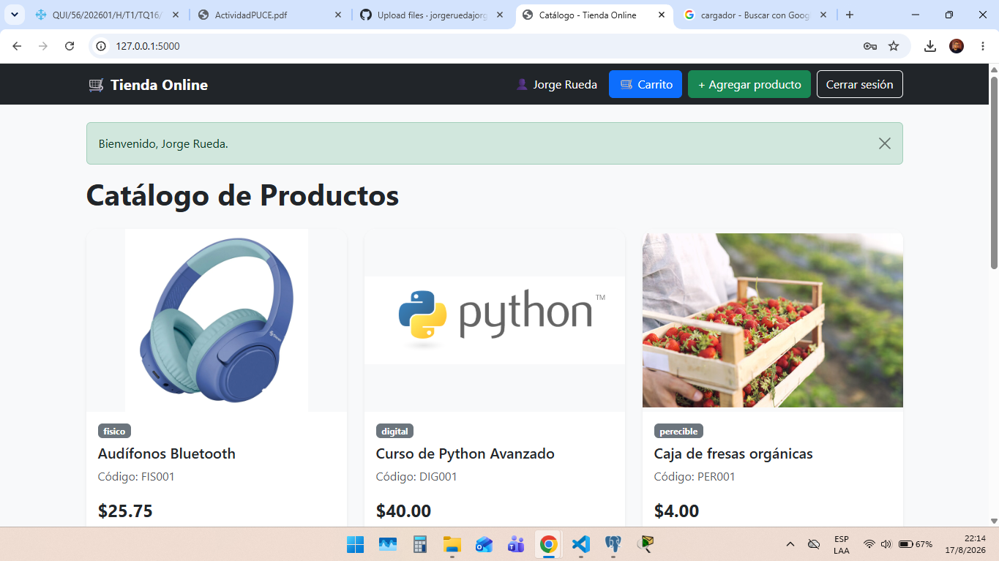
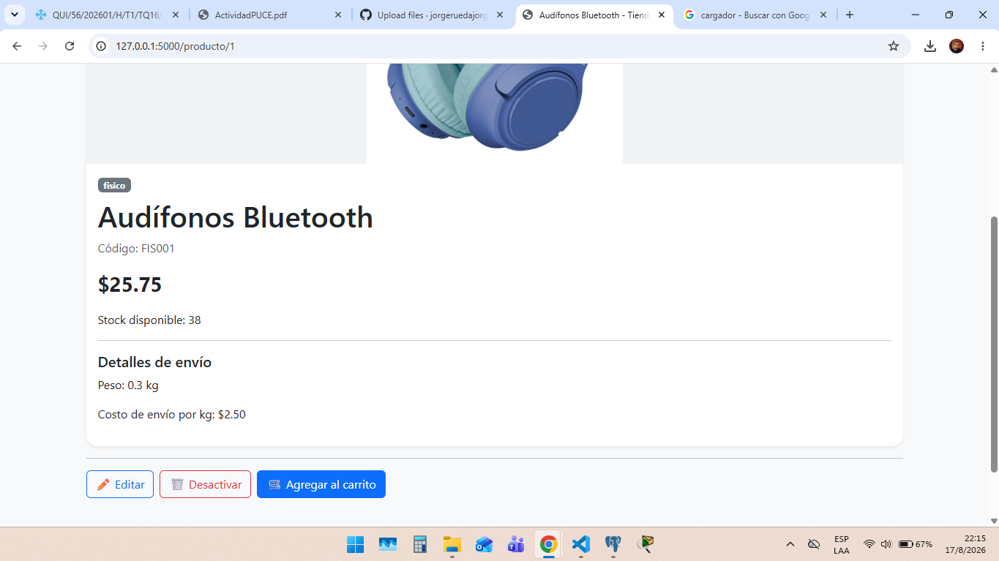
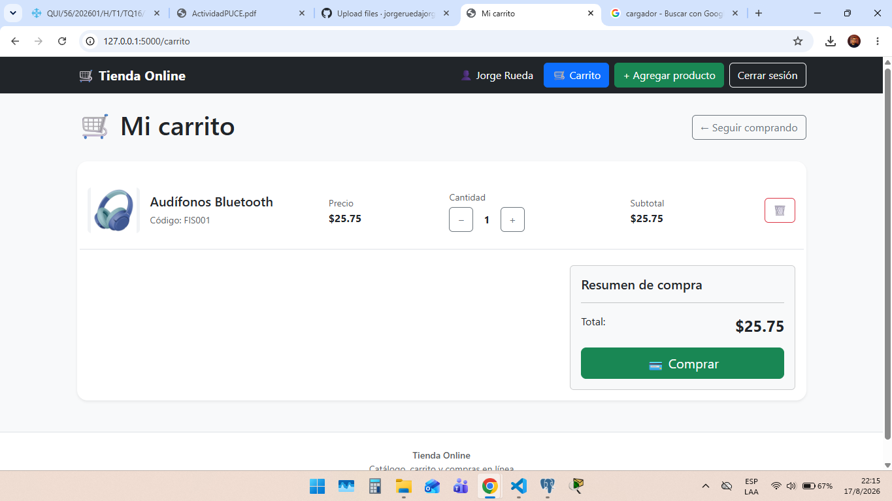
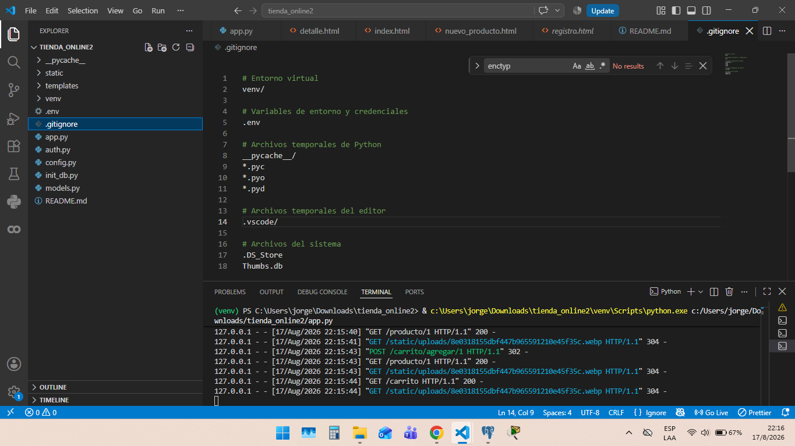

# Tienda Online

Aplicación web de una tienda online desarrollada con **Flask, Python y PostgreSQL**. El proyecto permite gestionar productos, usuarios, carrito de compras y pedidos mediante una interfaz web desarrollada con HTML, CSS y Bootstrap.

## Descripción

La aplicación permite visualizar un catálogo de productos y consultar el detalle de cada uno. También permite registrar usuarios, iniciar sesión, administrar productos y realizar compras mediante un carrito.

Como parte de las mejoras realizadas, se incorporó la posibilidad de **subir y visualizar imágenes de los productos**, además de mejorar el diseño de la aplicación mediante **Bootstrap** y adaptar las páginas para diferentes tamaños de pantalla.

## Tecnologías utilizadas

- Python
- Flask
- PostgreSQL
- SQLAlchemy
- HTML5
- CSS3
- Bootstrap
- Jinja2
- Git
- GitHub

## Funcionalidades principales

- Registro de usuarios.
- Inicio de sesión.
- Manejo de usuarios y roles.
- Visualización del catálogo de productos.
- Consulta del detalle de un producto.
- Creación de productos.
- Edición de productos.
- Desactivación de productos.
- Subida de imágenes de productos.
- Visualización de imágenes en el catálogo y detalle.
- Carrito de compras.
- Aumento y disminución de cantidades.
- Eliminación de productos del carrito.
- Proceso de checkout.
- Confirmación de pedidos.
- Diseño responsive utilizando Bootstrap.

## Estructura del proyecto

```text
tienda_online/
│
├── app.py
├── models.py
├── config.py
├── requirements.txt
├── README.md
├── .gitignore
│
├── static/
│   └── uploads/
│       └── imágenes de productos
│
└── templates/
    ├── base.html
    ├── index.html
    ├── detalle.html
    ├── nuevo_producto.html
    ├── editar.html
    ├── carrito.html
    ├── login.html
    ├── registro.html
    └── pedido_confirmado.html
```

## Requisitos

Para ejecutar el proyecto se necesita tener instalado:

- Python 3
- PostgreSQL
- Git

## Instalación

### 1. Clonar el repositorio

```bash
git clone URL_DEL_REPOSITORIO
```

### 2. Entrar a la carpeta del proyecto

```bash
cd tienda_online
```

### 3. Crear el entorno virtual

En Windows:

```powershell
python -m venv venv
```

### 4. Activar el entorno virtual

```powershell
venv\Scripts\activate
```

### 5. Instalar las dependencias

```powershell
pip install -r requirements.txt
```

## Configuración de la base de datos

El proyecto utiliza **PostgreSQL** como sistema gestor de base de datos.

Antes de ejecutar la aplicación se debe disponer de una base de datos PostgreSQL configurada de acuerdo con los datos de conexión utilizados por el proyecto.

Las credenciales y datos sensibles de conexión deben mantenerse fuera del repositorio, por ejemplo mediante un archivo `.env`.

> El archivo `.env` no debe subirse a GitHub.

## Ejecución

Una vez configurado el entorno y la base de datos, ejecutar:

```powershell
python app.py
```

La aplicación estará disponible normalmente en:

```text
http://127.0.0.1:5000
```

## Imágenes de productos

La aplicación permite seleccionar una imagen al crear o editar un producto.

Las imágenes se almacenan en:

```text
static/uploads/
```

Los formatos admitidos son:

- PNG
- JPG
- JPEG
- GIF
- WEBP

Las imágenes también se muestran en:

- Catálogo de productos.
- Detalle del producto.
- Carrito de compras.

## Diseño de la interfaz

La interfaz utiliza **Bootstrap** para mejorar la presentación visual y la adaptación a diferentes dispositivos.

Entre las mejoras realizadas se encuentran:

- Tarjetas para los productos.
- Imágenes con tamaños uniformes.
- Botones de acción.
- Badges para identificar el tipo de producto.
- Formularios organizados.
- Navegación responsive.
- Diseño adaptable para dispositivos móviles.
- Presentación visual del carrito y pedido.

## Credenciales de prueba

### Administrador

```text
Usuario: [jorge@gmail.com]
Contraseña: [123456]
```

### Cliente

```text
Usuario: [cliente@gmail.com]
Contraseña: [123456]
```

> Reemplazar los valores anteriores por las credenciales de prueba que se utilizarán durante la presentación.

### Catálogo



### Detalle del producto



### Carrito de compras



### Gestión de productos


## Autor

**Jorge Rueda**

Proyecto académico de desarrollo de una tienda online.
